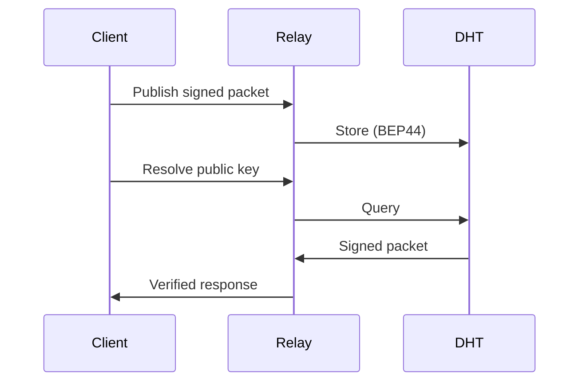

# Pkarr

> Own your identity. No registrars. No platforms. Just your keys.

[](https://crates.io/crates/pkarr) [](https://docs.rs/pkarr) [](./LICENSE)

Pkarr turns Ed25519 public keys into domain names that you truly own. Publish DNS records to the Bittorrent peer-to-peer network with 10+ million nodes. No registrar can seize your domain. No platform can deplatform your identity.

## Quick Start

```bash
cargo add pkarr
```

```rust
use pkarr::{Client, Keypair, SignedPacket};

#[tokio::main]
async fn main() -> anyhow::Result<()> {
    // Generate your identity
    let keypair = Keypair::random();
    println!("Your public key: {}", keypair.public_key());

    // Create and sign DNS records
    let packet = SignedPacket::builder()
        .txt("_hello".try_into()?, "world".try_into()?, 3600)
        .sign(&keypair)?;

    // Publish to the network
    let client = Client::builder().build()?;
    client.publish(&packet, None).await?;

    println!("Published! Resolve at: https://pkdns.net/?id={}", keypair.public_key());
    Ok(())
}
```

## Documentation

| Guide | Description |
|-------|-------------|
| **[Introduction](./docs/introduction.md)** | Philosophy, concepts, and why Pkarr exists |
| **[Quickstart](./docs/quickstart.md)** | Get started in 5 minutes |
| **[Integration Guide](./docs/integration.md)** | Embedding Pkarr in your application |
| **[Feature Reference](./docs/features.md)** | Cargo feature flags and configurations |
| **[API Reference](https://docs.rs/pkarr/latest/pkarr/)** | Full Rust API documentation |
| **[Examples](./pkarr/examples/README.md)** | Code samples |
| **[Specifications](./design/README.md)** | Protocol design documents |

## Demo

Try the [web app](https://pkdns.net) to resolve records in your browser.

## How It Works

1. **Generate a keypair** — Your public key becomes your domain name
2. **Sign DNS records** — Standard A, AAAA, TXT, CNAME records, self-signed
3. **Publish to the DHT** — Records stored on the [Mainline DHT](https://en.wikipedia.org/wiki/Mainline_DHT) (10M+ nodes)
4. **Resolve anywhere** — Anyone can query and verify your records



### The Network

Pkarr uses [Mainline DHT](https://en.wikipedia.org/wiki/Mainline_DHT), the same peer-to-peer network that powers BitTorrent. Records are stored using [BEP44](https://www.bittorrent.org/beps/bep_0044.html) (mutable items). With 15 years of proven reliability and 10+ million active nodes, there's no need to bootstrap a new network.

### Key Points

- **Records are ephemeral** — The DHT drops records after hours; republish periodically
- **1000-byte limit** — Pkarr is for discovery, not storage
- **Caching everywhere** — Clients and relays cache aggressively for performance
- **Relays for browsers** — Web apps use HTTP relays since browsers cannot open UDP sockets

Pkarr is the I/O library that reads and writes DNS records to the DHT.

## FAQ

<details>
<summary><strong>Why not blockchain domains (ENS, Handshake)?</strong></summary>

Blockchain domains introduce artificial scarcity, transaction fees, and chain dependencies. Pkarr uses public keys directly—infinite supply, zero fees, no chain lock-in.
</details>

<details>
<summary><strong>Why not GNU Name System?</strong></summary>

GNS is sophisticated but requires the full GNU net stack. Pkarr takes a minimalist approach: leverage existing infrastructure (Mainline DHT) and leave advanced features to application layers. Both use Ed25519, so migration paths exist.
</details>

<details>
<summary><strong>Why Mainline DHT specifically?</strong></summary>

It already exists. 15 years of reliability, 10+ million nodes, implementations in most languages. No need to bootstrap a new network or convince people to join.
</details>

<details>
<summary><strong>What about human-readable names?</strong></summary>

Public keys are not memorable by design—memorable names require registries, and registries introduce centralization. Build petname systems, phonebooks, or DNS bridges on top of Pkarr if you need human-friendly names.
</details>

## License

[MIT](./LICENSE)
