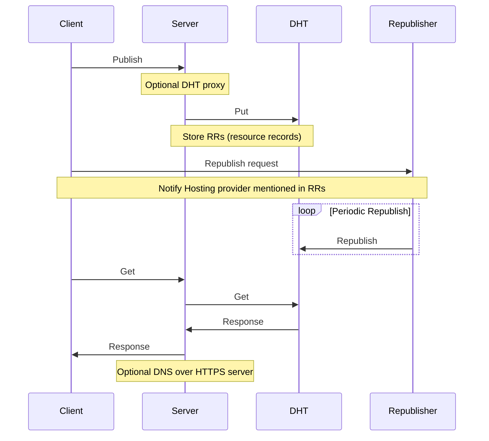

# Pkarr

> Public-Key Addressable Resource Records

The simplest possible streamlined integration between the Domain Name System and peer-to-peer overlay networks, enabling self-issued public keys to function as sovereign, publicly addressable domains. This system would be accessible to anyone capable of maintaining a private key.

Where we are going, this [https://54ftp7om3nkc619oaxwbz4mg4btzesnnu1k63pukonzt36xq144y](https://pkarr.nuhvi.com/?pk=54ftp7om3nkc619oaxwbz4mg4btzesnnu1k63pukonzt36xq144y) resolves everywhere!

## TLDR
- To publish resource records for your key, sign a small payload (<= ~3000 bytes) and publish it on the DHT (throug a relay if necessary).
- To resolve some key's resources, applications query the DHT directly, or through a relay, and verify the signature themselves. 
- Existing applications unaware of Pkarr make normal DNS Queries over HTTPS ([DoH](https://www.rfc-editor.org/rfc/rfc8484)) to Pkarr servers. 
- Clients and Pkarr servers cache records extensively and minimize DHT traffic as much as possible for improved scalability. 
- The DHT drops records after a few hours, so users, their friends, or service providers should periodically republish their records to the DHT. Also Pkarr servers could republish records recently requested, to keep popular records alive too.

## DEMO 

Try the [web app demo](https://pkarr.nuhvi.com).

Or if you prefer a [CLI](./js/README.md#cli) 

## TOC
- [Architecture](#Architecture)
- [Expectations](#Expectations)
- [Why](#Why)
- [Roadmap](#Roadmap)
- [FAQ](#FAQ)
 
## Architecture

### Clients
 #### Pkarr enabled applications.
 
 Native applications, can directly query and verify signed records from the DHT if they are not behind NAT. Otherwise, they will need to use a Pkarr server as a relay.

 Browser web apps should try calling local Pkarr server at the default port `7527`, if not accessible, they have to query a remote server instead. Eitherway, these apps should allow users to configure servers of their choice.
 
 Clients with private keys are also capable of submitting signed records either to the DHT directly, or through Pkarr server, to update user's records when needed.
 
 #### Existing applications
 To support existing applications totally oblivious of Pkarr, users will have to (manually or programatically) edit their OS DNS servers to add one or more Pkarr servers to proxy DHT records as DNS over HTTPS.

### Servers

Pkarr servers are optional but they:
1. Trustlessly relay requests from Web apps and applications behind NAT or firewall, to the DHT.
2. Offer a DoH interface for applications that aren't aware of Pkarr at all, so they can resolve something like `https://<key>` as usual.

Servers are very light and cheap to operate, that they can easily run altruistically, but private, and paid servers are possible too.

### Republishers

Services and hosting providers mentioned in Resource Records of a user, are incentivized to republish these records and keep them alive on the DHT, for the same reasons they are incentivized to gain that user in the first place.

### DHT

Pkarr will use [Mainline_DHT](https://en.wikipedia.org/wiki/Mainline_DHT) as the overlay network.
Specifically [BEP44](https://www.bittorrent.org/beps/bep_0044.html) for storing ephemeral arbitrary data.

Reasons for choosing Mainline include:
1. 15 years of proven track record facilitating trackerless torrent for people around the world.
2. Biggest DHT in existence with estimated 10 million nodes.
3. It is fairly generous with its retaining of mutable data, reducing the need to frequently refresh records, thus reducing traffic.
4. It has implementation in most languagues, well understood (by many smart people, that may be willing to guide us), and stable enough to make a minimal implementation from scratch if we need to.

## Expectations

To ensure a good chance of scalability and resilience, a few expectations need to be set straight:

1. This is **not a storage platform**
    - Records are ephemeral, and without refreshing them regularly they will be dropped by the DHT.
    - Popular records may or may not be refreshed by the DNS servers as they get queries for them.
2. This is **not a realtime communication** medium
    - Records are heavily cached like in any DNS system.
    - You are expected to update your records rarely, so you should expect servers to enforce harsh rate-limiting and maybe demand proof of work.
    - Records are going to be cached heavily to reduce traffic on the DHT, so updates might take some time to propagate, even if you set TTL to 1 second.
    - In case of a chache miss, traversing the DHT might take few seconds.

## Why?

> Why would you need resource records for keys

In pursuit of a sovereign, distributed, and open web, we identify three challenges:

1. **Distributed Semantics** `Everything expressed as keys and metadata`
Developing interoperable semantics for verifiable metadata about a set of public-keys that form a digital identity, complete with reputation, social graph, credentials, and more.

2. **Distributed Database(s)** `Anyone can host the data`
Verifiable data alone is insufficient; a host-agnostic database is essential for an open web, as opposed to walled gardens.

3. **Distributed Discovery** `Where is the data?`
But before that, you need to efficiently and consistently discover the multiple hosts for a given data-set.

Addressing Distributed Discovery first makes the most sense for several reasons:

- The difficulty of these three challenges inversely correlates with their order.
- The marginal utility of solving these challenges positively correlates with their order.

    In existing and emerging open social network protocols, users do tolerate limited interoperability between clients, second-class identifiers controlled by hosting or domain servers, inefficient or non-existent conflict-free replication between data stores, and the absence of local-first or offline support. However, their most common complaints involve unavailability, censorship, deplatforming, and difficulty in securely managing keys.

- Distributed Discovery offers the greatest assured leverage by abstracting over current and emerging solutions for (1) and (2) as they compete, complement, and develop independently, all while maintaining the same long lasting identifier, so you don't have to start from scratch or be locked in.

### leverage

**Solve the most issues...**

Pkarr solves **unavailability** by turning public-keys to resolvable URL: resource **locator**.
Pkarr solves **censorship and deplatforming** by allowing users to conveniently change DNS records to point to other providers or platforms. While there are other ways to do that, it is never as reliable and authoritative as DNS.
Pkarr help with **key management** by enabling users to maintain a long lasting identity tied to one key, rarely used, and hopefully kept offline at all times.

Finally, by solving censorship and deplatforming ina sovereign way, the need for signed data becomes less urgent, and we buy more time to figure out the UX of signing everything everywhere all the time.

**with least work**

Pkarr doesn't need to bootstrap anything or invent anything, instead using 15 years old battle tested Distributed Hash Table with millions of nodes, and good old web servers.

## Roadmap

1. [x] Implement a web server as a mere proxy over DHT.
2. [x] Implement client-side tools for making queries and validating responses.
3. [x] Implement a web app to represent the UX and DX of client side.
4. [x] ClI - publish and resolve resource records.
5. [ ] Add optional caching and republishing of records on GET requests **<< we ar here**
6. [ ] Implement a standalone republisher and test keeping 100s of thousands of records alive.
7. [ ] Reimplement everything in Rust once the JS implementation is tested with some scale.
8. [ ] Add the DNS over HTTPS features and documentations for adding Pkarr servers in OS and browser's configurations.

## FAQ

1. **Why not human readable domains on a blockchain?**

    Introducing scarcity to names, arguably the most subjective and personal thing in our lives, serves noone except rent seekers. We already know how to use phonebooks, we just need to upgrade small numbers, to bigger sovereign keys.
    
1. **Why not GNU Name System?**

    The GNU net is exciting and impressive, but I didn't have enough time to test it or understand how hard it would be to build a PoC on top of it.
    
    GNU name system seems to support [Petname system](http://www.skyhunter.com/marcs/petnames/IntroPetNames.html)  natively, which means it does require more storage and bandwith from the DHT than a 1000 bytes max size enforced by Mainline DHT. I believe that petnameing should be left to application layer. 

    Luckily GNU net uses ed25519 key as well, so there is always a path for migration if we are careful.

2. **Why not [insert ad hoc solution] instead?**
Open social networks often attempt to solve discovery natively within their network of participants. However, this approach has several issues:
    - It may conflict with participants' (usually service providers) self-interest in keeping users locked in.
    - Their infrastructure would need to become a gossip overlay network, which may not be desirable.
    - Achieving consistency and load balancing would require further optimization, effectively reinventing a DHT.
    - If an overlay network is developed that surpasses the performance of a 10-million-node DHT with a 15-year track record, Pkarr should still be capable of utilizing your network as a backend, either as an alternative or alongside existing solutions.
