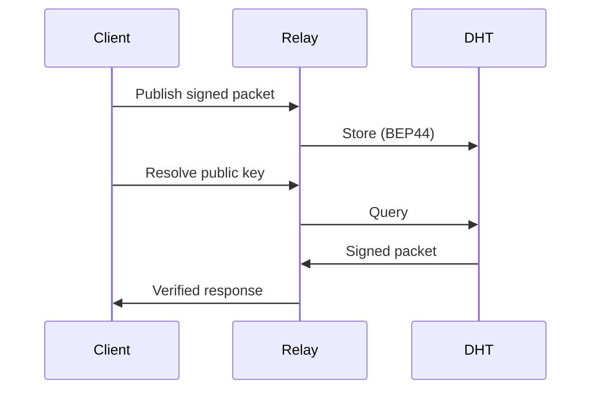

# PKARR

> Own your identity. No registrars. No platforms. Just your keys.

[](https://crates.io/crates/pkarr) [](https://docs.rs/pkarr) [](./LICENSE)

PKARR turns Ed25519 public keys into domain names that you truly own. Publish DNS records to the Bittorrent peer-to-peer network with 10+ million nodes. No registrar can seize your domain. No platform can deplatform your identity.

Where we are going, this https://o4dksfbqk85ogzdb5osziw6befigbuxmuxkuxq8434q89uj56uyy resolves everywhere!

## Quick Start

```bash
cargo add pkarr
```

```rust
use pkarr::{Client, Keypair, SignedPacket};

#[tokio::main]
async fn main() -> anyhow::Result<()> {
    // Generate your identity
    let keypair = Keypair::random();
    println!("Your public key: {}", keypair.public_key());

    // Create and sign DNS records
    let packet = SignedPacket::builder()
        .txt("_hello".try_into()?, "world".try_into()?, 3600)
        .sign(&keypair)?;

    // Publish to the network
    let client = Client::builder().build()?;
    client.publish(&packet, None).await?;

    println!("Published! Resolve at: https://pkdns.net/?id={}", keypair.public_key());
    Ok(())
}
```

## Documentation

| Guide | Description |
|-------|-------------|
| **[Introduction](./docs/introduction.md)** | Philosophy, concepts, and why PKARR exists |
| **[Quickstart](./docs/quickstart.md)** | Get started in 5 minutes |
| **[Integration Guide](./docs/integration.md)** | Embedding Pkarr in your application |
| **[Feature Reference](./docs/features.md)** | Cargo feature flags and configurations |
| **[API Reference](https://docs.rs/pkarr/latest/pkarr/)** | Full Rust API documentation |
| **[Examples](./pkarr/examples/README.md)** | Code samples |
| **[Specifications](./design/README.md)** | Protocol design documents |

## Demo

Try the [web app](https://pkdns.net) to resolve records in your browser.

## How It Works

1. **Generate a keypair** — Your public key becomes your domain name
2. **Sign DNS records** — Standard A, AAAA, TXT, CNAME records, self-signed
3. **Publish to the DHT** — Records stored on the [Mainline DHT](https://en.wikipedia.org/wiki/Mainline_DHT) (10M+ nodes)
4. **Resolve anywhere** — Anyone can query and verify your records


```mermaid
sequenceDiagram
    participant Client
    participant Relay
    participant DHT

    Client->>Relay: Publish signed packet
    Relay->>DHT: Store (BEP44)

    Client->>Relay: Resolve public key
    Relay->>DHT: Query
    DHT->>Relay: Signed packet
    Relay->>Client: Verified response
```

### The Network

PKARR uses the [Mainline DHT](https://en.wikipedia.org/wiki/Mainline_DHT), the same peer-to-peer network that powers BitTorrent. Records are stored using [BEP44](https://www.bittorrent.org/beps/bep_0044.html) (mutable items). With 15 years of proven reliability and 10+ million active nodes, there's no need to bootstrap a new network.

### Key Points

- **Records are ephemeral** — The DHT drops records after hours; republish periodically
- **1000-byte limit** — PKARR is for discovery, not storage
- **Caching everywhere** — Clients and relays cache aggressively for performance
- **Relays for browsers** — Web apps use HTTP relays since browsers cannot open UDP sockets

PKARR is the I/O library that reads and writes DNS records to the DHT.
### Clients
#### Pkarr-enabled Applications

Native applications can directly query and verify signed records from the DHT if they are not behind NAT. Otherwise, they will need to use a Pkarr Relay.

Browser web apps should try calling the local Pkarr relay at the default port 6881. If not accessible, they must query a remote relay as a fallback. In either case, these apps should allow users to configure relays of their choice.

Clients with private keys can also submit signed records either directly to the DHT or through a Pkarr relay to update their records when needed.

#### Existing Applications
To support existing applications that are unaware of Pkarr, users will need to (manually or programmatically) edit their OS DNS servers to add one or more DNS servers that recognize Pkarr and query the DHT. However, the ideal outcome would be adoption by existing widely used resolvers like `1.1.1.1` (Cloudflare) and `8.8.8.8` (Google).

### Relays

Pkarr relays are optional but they:
1. Enable web applications to query the DHT through [relays](https://pkarr.org/relays)
2. Act as a large caching layer for many users to provide lower latency, better reliability, and improved scalability

Relays are very light and cheap to operate, making them easy to run altruistically. Private and paid relays are also possible.

A relay can be easily run with docker by cloning the repository and running `docker compose up -d`

### Republishers

Services and hosting providers mentioned in a user's Resource Records are incentivized to republish these records and keep them alive on the DHT, for the same reasons they are incentivized to gain that user in the first place.

### DHT

Pkarr uses [Mainline DHT](https://en.wikipedia.org/wiki/Mainline_DHT) as the overlay network,
specifically [BEP44](https://www.bittorrent.org/beps/bep_0044.html) for storing ephemeral arbitrary data.

Reasons for choosing Mainline include:
1. 15 years of proven track record facilitating trackerless torrents worldwide
2. Largest DHT in existence with an estimated 10 million nodes
3. Generous retention of mutable data, reducing the need for frequent record refreshes
4. Implementations available in most languages, well understood by many experts, and stable enough for minimal custom implementation if needed

## Expectations

To ensure good scalability and resilience, a few expectations need to be set:

1. This is **not a storage platform**
    - Records are ephemeral and will be dropped by the DHT without regular refreshing
    - Popular records may be refreshed by DNS servers as they receive queries
2. This is **not a realtime communication** medium
    - Records are heavily cached like in any DNS system
    - Record updates should be infrequent, and relays enforce strict rate-limiting
    - Record updates may take time to propagate due to extensive caching, even with a 1-second TTL
    - In case of a cache miss, traversing the DHT might take few seconds.

## Why?

> Why would you need resource records for keys?

In pursuit of a sovereign, distributed, and open web, we identify three challenges:

1. **Distributed Semantics**: `Everything expressed as keys and metadata`Developing interoperable semantics for verifiable metadata about a set of public keys that form a digital identity, complete with reputation, social graph, credentials, and more.

2. **Distributed Database(s)**: `Anyone can host the data`
Verifiable data alone is insufficient; a host-agnostic database is essential for an open web, as opposed to walled gardens.

3. **Distributed Discovery**: `Where is the data?`
Before anything else, you need to efficiently and consistently discover the multiple hosts for a given dataset.

Addressing Distributed Discovery first makes the most sense for several reasons:

- The difficulty of these three challenges inversely correlates with their order.
- The marginal utility of solving these challenges positively correlates with their order.

    In existing and emerging open social network protocols, users do tolerate limited interoperability between clients, second-class identifiers controlled by hosting or domain servers, inefficient or non-existent conflict-free replication between data stores, and the absence of local-first or offline support. However, their most common complaints involve unavailability, censorship, deplatforming, and difficulty in securely managing keys.

- Distributed Discovery offers the greatest assured leverage by abstracting over current and emerging solutions for (1) and (2) as they compete, complement, and develop independently, all while maintaining the same long lasting identifier, so you don't have to start from scratch or be locked in.

### Leverage

**Solve the most issues**

Pkarr solves **unavailability** by turning public keys into resolvable URLs: resource **locator**.
Pkarr solves **censorship and deplatforming** by allowing users to conveniently change DNS records to point to other providers or platforms. While there are other ways to do this, it is never as reliable and authoritative as DNS.
Pkarr helps with **key management** by enabling users to maintain a long-lasting identity tied to one key, rarely used, and hopefully kept offline at all times.

Finally, by solving censorship and deplatforming in a sovereign way, the need for signed data becomes less urgent, and we buy more time to figure out the UX of signing everything everywhere all the time.

**with least work possible**

Pkarr doesn't need to bootstrap anything or invent anything, instead using 15 years old battle tested Distributed Hash Table (Mainline DHT) with millions of nodes, and good old web servers.

## FAQ

<details>
<summary><strong>Why not blockchain domains (ENS, Handshake)?</strong></summary>

Blockchain domains introduce artificial scarcity, transaction fees, and chain dependencies. PKARR uses public keys directly—infinite supply, zero fees, no chain lock-in.
</details>

<details>
<summary><strong>Why not GNU Name System?</strong></summary>

GNS is sophisticated but requires the full GNU net stack. PKARR takes a minimalist approach: leverage existing infrastructure (Mainline DHT) and leave advanced features to application layers. Both use Ed25519, so migration paths exist.
</details>

<details>
<summary><strong>Why Mainline DHT specifically?</strong></summary>

It already exists. 15 years of reliability, 10+ million nodes, implementations in most languages. No need to bootstrap a new network or convince people to join.
</details>

<details>
<summary><strong>What about human-readable names?</strong></summary>

Public keys are not memorable by design—memorable names require registries, and registries introduce centralization. Build petname systems, phonebooks, or DNS bridges on top of PKARR if you need human-friendly names.
</details>

## License

[MIT](./LICENSE)
