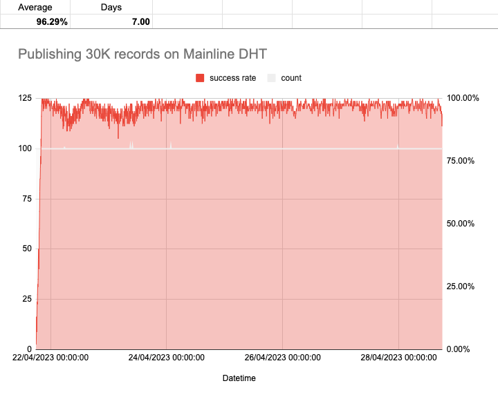

# Republish

The goal of this is to validate the scalability of republishing records on behalf of users.

## Metrics

1. Medium server (30,000 users)
2. Single core
3. resolve records for random key every 10 minutes with >95% success rate
4. duration: few days to a week

## Usage

Generate users keys and signatures

```bash
node generate.js
```

Start republishing

```bash
node republish.js
```

Start sampling random keys to query

```bash
node sampler.js
```

## Result

After 7 days of continous running, result was an average of ~96% query success rate.



[Data source](https://docs.google.com/spreadsheets/d/12inuULrluZwPw-YLn-PtsYEW2D0hBABVrz506jQbP94/edit#gid=0)
